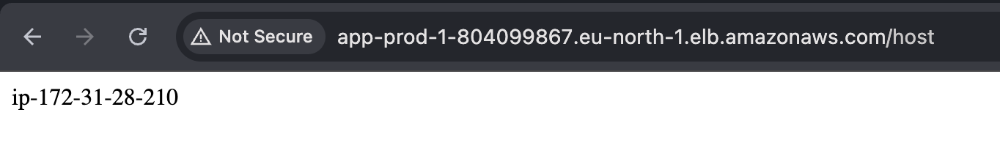

# 🚀 AWS EC2 + Auto Scaling Group Setup Guide

This guide outlines the full setup process for deploying an application on an AWS EC2 instance, baking it into an AMI, and configuring Auto Scaling with a Load Balancer and dynamic scaling policies.

---

## 1. ✅ Launch an EC2 Instance

* Go to AWS EC2 Dashboard
* Click on **Launch Instance**
* Choose an Ubuntu 22.04 AMI
* Choose an instance type (e.g., `t2.micro` for free tier)
* Configure key pair for SSH access
* Select/Create a security group allowing at least port 22 (SSH) and 80/443 (web)
* Launch the instance

---

## 2. 🔐 SSH into the EC2 Instance

```bash
ssh -i path/to/key.pem ubuntu@<ec2-public-ip>
```

---

## 3. ⚙️ Install Node.js and Bun

### Install Node.js

Follow this guide: [DigitalOcean Node.js Ubuntu 22.04](https://www.digitalocean.com/community/tutorials/how-to-install-node-js-on-ubuntu-22-04)

Or run:

```bash
curl -fsSL https://deb.nodesource.com/setup_18.x | sudo -E bash -
sudo apt-get install -y nodejs
```

### Install Bun

```bash
npm install -g bun
```

---

## 4. 📦 Clone and Run the Repo

```bash
git clone https://github.com/100xdevs-cohort-3/ASG
cd ASG
bun install
bun bin.ts
```

---

## 5. ♻️ Install and Use PM2

```bash
npm install -g pm2
which bun
pm2 start --interpreter /home/ubuntu/.nvm/versions/node/v22.16.0/bin/bun bin.ts
```

---

## 6. 🖼️ Create an AMI

* Go to EC2 → Instances → Select your instance
* Click **Actions → Image and templates → Create image**
* Name your AMI and create it

---

## 7. 📄 Create a Launch Template

* Go to EC2 → Launch Templates → Create launch template
* Use the AMI you just created
* Choose the same instance type
* Set user data or network settings if needed
* Attach your existing security group
* Update user data 

```bash
#!/bin/bash
cd ~/AutoScaling
export PATH=$PATH:/home/ubuntu/.nvm/versions/node/v22.16.0/bin/
npm i -g pm2
pm2 start --interpreter /home/ubuntu/.nvm/versions/node/v22.16.0/bin/bun /home/ubuntu/AutoScaling/bin.ts
```

---

## 8. 🎯 Create a Target Group

* Go to EC2 → Target Groups → Create target group
* Type: **Instance**
* Protocol: HTTP, Port: 80
* VPC: Same as your instance
* Health check: Path `/` or your app's endpoint

---

## 9. 📦 Create an Auto Scaling Group (ASG)

* Go to EC2 → Auto Scaling Groups → Create
* Select the launch template you just created
* Choose the VPC and subnets
* Attach the previously created **Target Group**
* During the process, create a new **Application Load Balancer**:

  * Type: Internet-facing
  * Listener: HTTP:80
  * Register the Target Group with this ALB
  * Attach a sg 

---

## 10. 📈 Add Dynamic Scaling Policy

* In the ASG → Automatic Scaling → Add policy
* Choose **Target Tracking Scaling Policy**
* Example metric: **Average CPU Utilization**
* Target value: e.g., 50%

---

## ✅ You’re Done!

You now have:
 
* A load-balanced, auto-scaling setup giving diffent ips on refresh. Means it's working
* A pre-baked AMI with your app
* A robust deployment architecture

